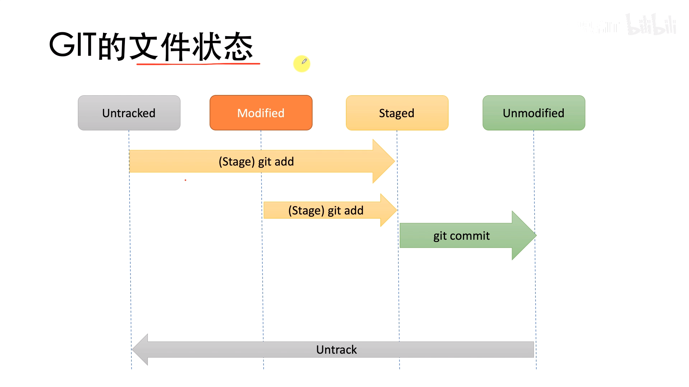
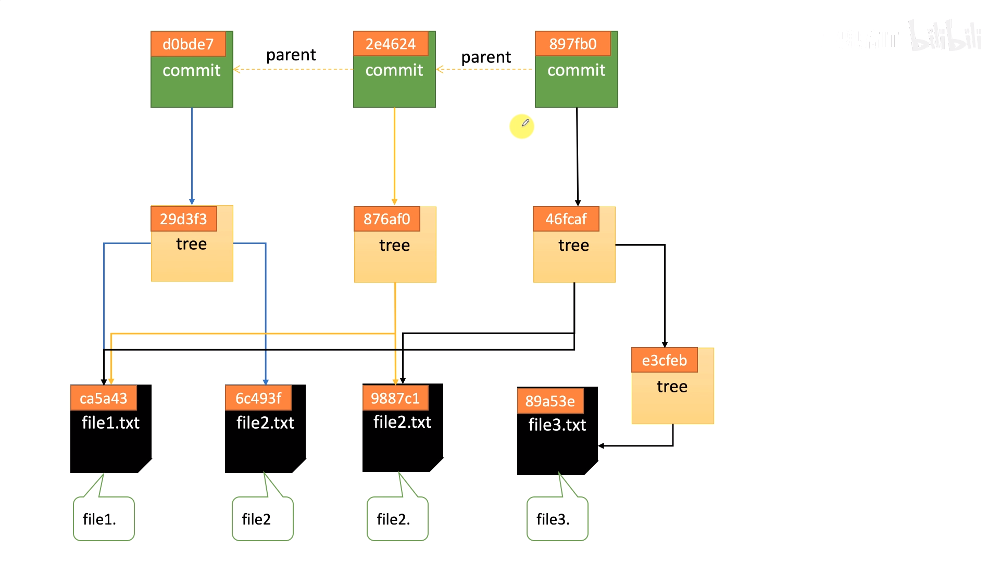
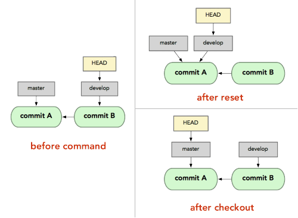
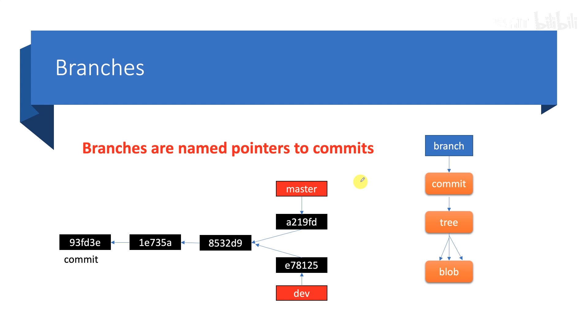

<h1 align = "center">Git Fast Reference Manual</h1>

## Description

At First, you should enter your destination folder constructed .git file, and then input follow command in terminal recording to your requirement

## 1. Construct Repository
​	$ git init

## 2. Add and Restore

add some changes file from Current WorkPlace to Stage Area

​	$ git add filename 

​	$ git add .

restore some changes file from Stage Area to Current Workplace

​	$ git restore filename

​	$ git restore .

additional, you command that $ rm filename, if you think the file is useless.

then, delete the file in Stage Area, or restore it

​	$ git rm filename

## Commit and Restore

commit all file in Stage Area, at the same time, you should summarize message about this modify content

the message is useful, when you want to checkout and modify some commit version previous.

​	$ git commit -m "message"

modify the last commit, but don't amend published commits!

​	$ git commit --amend

Restore some changes file from Commit Area to Stage Area

​	$ git restore --staged filenname

​	$ git restore --staged .

## Commit History

show git status

​	$ git status

show all commits, starting with newest

​	$ git log

​	$ git log --pretty=oneline

show all git command in the commit pointed by HEAD, starting with newest.

​	$ git reflog

## Cat-file and Ls-files

view all files in Stage Area

​		$ git ls-files

view Blob object, get the Hash value of file

​		$ git ls-files -s filename

view content by Hash value of file

​		$ git cat-file -p commit_ID

## Unset and Checkout

go back or modify previous commit version

move HEAD and branch together to commit_ID or commit_ID pointed by the other branch. 

the content of Current WorkPlace and Stage Area will equal to the commit content, 

unless untracked files(new files in WorkPlace will be saved anywhere)

That mean you should save your modify file(new a branch, add and commit the file)

​	$ git reset --hard commit_ID

​	$ git reset --hard branch_name

switch/checkout between branch

​	$ git checkout branch_name		

switch/checkout  to special commit ID

​	$ git checkout commit_ID

you should new a branch to save this commit when you checkout a previous commit version, modify file, add and commit 

​	$ git checkout -b branch_name

​	

## Branch

usually, don't work directly in master branch. at first, you should make a new branch, then work in the branch

show all branch

​	$ git branch

new a branch

​	$ git branch branch_name

new a branch and checkout HEAD to the branch  

​	$ git checkout -b branch_name

delete some branch

​	$ git branch -d branch_name

merge a branch pointed by HEAD to some branch_name

​	$ git merge branch_name

then delete the branch_name

## Bug and Stash

There is a interrupt in your live when you are working in a bug branch. you can stash your WorkPlace

​	$ git stash

view stash list

​	$ git stash list

restore WorkPlace in Stash Area, and delete the stash

​	$ git stash pop

## Remote Repository

show all remote repository

​	$ git remote

add remote Repository adress

example git remote add origin git@github.com:michaelliao/learngit.git

​	$ git remote add origin url

push master to origin, remote repository

​	$ git push -u origin master

after git commit --amend, after

​	$ git push -u origin master --force

clone a repository from remote repository

​	$ git clone url

